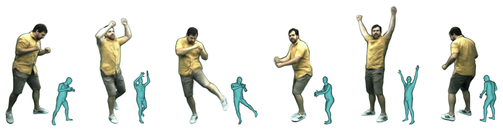
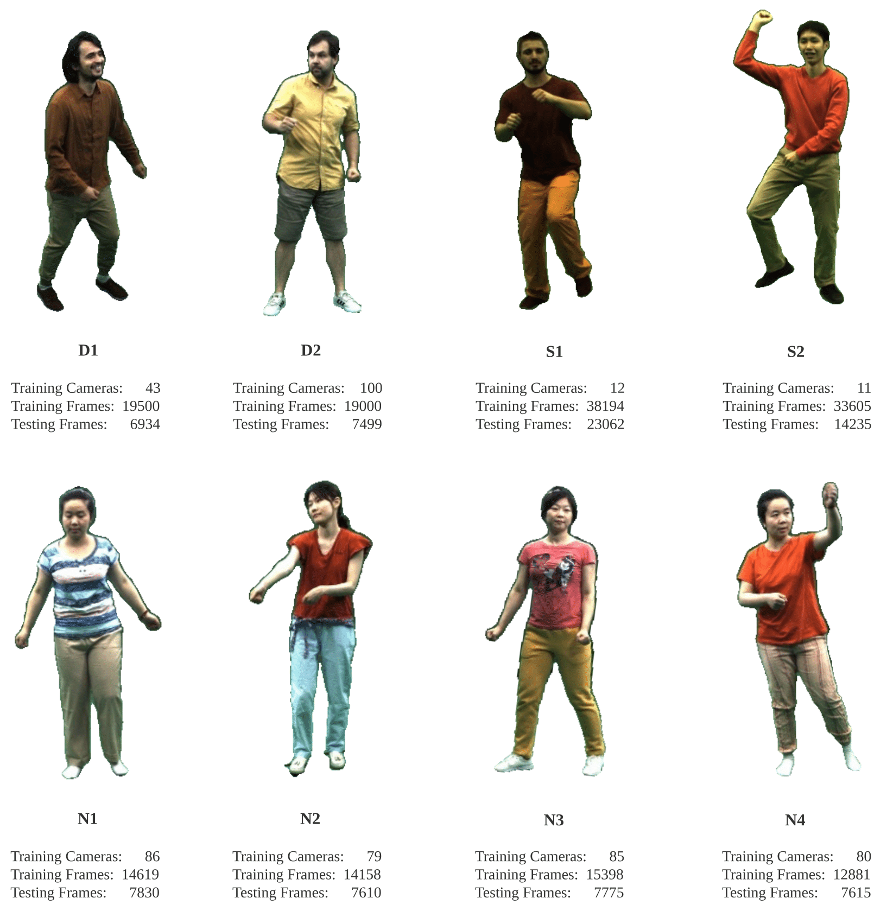

# Neural Actor: Neural Free-view Synthesis of Human Actors with Pose Control

### [Project Page](https://vcai.mpi-inf.mpg.de/projects/NeuralActor/) | [Video](https://vcai.mpi-inf.mpg.de/projects/NeuralActor/) | [Paper](https://arxiv.org/abs/2106.02019) | [Data](#dataset)



Abstract: *We propose Neural Actor (NA), a new method for high-quality synthesis of humans from arbitrary viewpoints and under arbitrary controllable poses. Our method is built upon recent neural scene representation and rendering works which learn representations of geometry and appearance from only 2D images. While existing works demonstrated compelling rendering of static scenes and playback of dynamic scenes, photo-realistic reconstruction and rendering of humans with neural implicit methods, in particular under user-controlled novel poses, is still difficult. To address this problem, we utilize a coarse body model as the proxy to unwarp the surrounding 3D space into a canonical pose. A neural radiance field learns pose-dependent geometric deformations and pose- and view-dependent appearance effects in the canonical space from multi-view video input. To synthesize novel views of high fidelity dynamic geometry and appearance, we leverage 2D texture maps defined on the body model as latent variables for predicting residual deformations and the dynamic appearance. Experiments demonstrate that our method achieves better quality than the state-of-the-arts on playback as well as novel pose synthesis, and can even generalize well to new poses that starkly differ from the training poses. Furthermore, our method also supports body shape control of the synthesized results.*


This is the official repository of "Neural Actor: Neural Free-view Synthesis of Human Actors with Pose Control" (SIGGRAPH Asia 2021)

## Table of contents
-----
  * [Installation](#requirements-and-installation)
  * [Dataset](#dataset)
  * [Usage](#train-a-new-model)
    + [Free-view Rendering Pipeline](#free-viewpoint-rendering-pipeline)
    + [Training](#train-a-new-model)
  * [License](#license)
  * [Citation](#citation)
------

## System requirements

This code is implemented based on [Neural Sparse Voxel Fields (NSVF)](https://github.com/facebookresearch/NSVF).
The code has been tested on the following system:

* Python 3.8
* PyTorch 1.6.0, torchvision 0.7.0
* [Nvidia apex library](https://github.com/NVIDIA/apex) (optional)
* Nvidia GPU (Tesla V100 32GB) CUDA 10.2

(**Please note that our codebase theoritically also work on higher PyTorch version >= 1.7.
However, due to some unexpected behavior changes in Conv2d at Pytorch 1.7, our pre-trained models would produce bad results.**)

Only learning and rendering on GPUs are supported.

## Installation

To install, first clone this repo and install all dependencies:

```bash
pip install -r requirements.txt
```

Then,  run

```bash
pip install --editable ./
```

Or if you want to install the code locally, run:

```bash
python setup.py build_ext --inplace
```

To train and generate texture maps, it is also needed to compile ```imaginaire``` following the [instruction](https://github.com/NVlabs/imaginaire/blob/master/INSTALL.md).
You can also run:
```
cd imaginaire; bash scripts/install.sh; cd ..
```

## Dataset
Please find the character mapping in our paper:



For the full dataset, please refer to this link with agreement. [TODO]

### Prepare your own dataset

TODO
<!-- To prepare a new dataset of a single scene for training and testing, please follow the data structure: -->

## Pre-trained Models

Character | Texture Predictor | Neural Renderer | Character | Texture Predictor | Neural Renderer
:---:|---|---|:---:|---|---
D1 | [Download (3.7G)](https://dl.fbaipublicfiles.com/nsvf/neural_actor/models/vid2vid/vid2vid_oleks.pt) | [Download (271M)](https://dl.fbaipublicfiles.com/nsvf/neural_actor/models/nerf/nerf_oleks.pt) | D2 | [Download (3.7G)](https://dl.fbaipublicfiles.com/nsvf/neural_actor/models/vid2vid/vid2vid_vlad.pt) | [Download (271M)](https://dl.fbaipublicfiles.com/nsvf/neural_actor/models/nerf/nerf_vlad.pt)
S1 | [Download (3.7G)](https://dl.fbaipublicfiles.com/nsvf/neural_actor/models/vid2vid/vid2vid_marc.pt) | [Download (271M)](https://dl.fbaipublicfiles.com/nsvf/neural_actor/models/nerf/nerf_marc.pt) | S2 | [Download (3.7G)](https://dl.fbaipublicfiles.com/nsvf/neural_actor/models/vid2vid/vid2vid_lan.pt) | [Download (271M)](https://dl.fbaipublicfiles.com/nsvf/neural_actor/models/nerf/nerf_lan.pt)
N1 | [Download (3.7G)](https://dl.fbaipublicfiles.com/nsvf/neural_actor/models/vid2vid/vid2vid_n1.pt) | [Download (271M)](https://dl.fbaipublicfiles.com/nsvf/neural_actor/models/nerf/nerf_n1.pt) | N2 | [Download (3.7G)](https://dl.fbaipublicfiles.com/nsvf/neural_actor/models/vid2vid/vid2vid_n2.pt) | [Download (271M)](https://dl.fbaipublicfiles.com/nsvf/neural_actor/models/nerf/nerf_n2.pt)
N3 | [Download (3.7G)](https://dl.fbaipublicfiles.com/nsvf/neural_actor/models/vid2vid/vid2vid_n3.pt) | [Download (271M)](https://dl.fbaipublicfiles.com/nsvf/neural_actor/models/nerf/nerf_n3.pt) | N4 | [Download (3.7G)](https://dl.fbaipublicfiles.com/nsvf/neural_actor/models/vid2vid/vid2vid_n4.pt) | [Download (271M)](https://dl.fbaipublicfiles.com/nsvf/neural_actor/models/nerf/nerf_n4.pt)

You can download the pretrained models for texture predictor and neural renderer of each character for [rendering pipeline](/docs/rendering_pipeline.md).

## Free Viewpoint Rendering Pipeline

We provide an [example](/docs/rendering_pipeline.md) of free-view video synthesis of a pre-trained human actor given arbitrary pose control.

## Train a new model

TODO


<!-- ## Train a new model

Given the dataset of a single scene (``{DATASET}``), we use the following command for training an NSVF model to synthesize novel views at ``800x800`` pixels, with a batch size of ``4`` images per GPU and ``2048`` rays per image. By default, the code will automatically detect all available GPUs.

In the following example, we use a pre-defined architecture ``nsvf_base`` with specific arguments:

* By setting ``--no-sampling-at-reader``, the model only samples pixels in the projected image region of sparse voxels for training.
* By default, we set the ray-marching step size to be the ratio ``1/8 (0.125)`` of the voxel size which is typically described in the ``bbox.txt`` file.
* It is optional to turn on ``--use-octree``. It will build a sparse voxel octree to speed-up the ray-voxel intersection especially when the number of voxels is larger than ``10000``.
* By setting ``--pruning-every-steps`` as ``2500``, the model performs self-pruning at every ``2500`` steps.
* By setting ``--half-voxel-size-at`` and ``--reduce-step-size-at`` as ``5000,25000,75000``,  the voxel size and step size are halved at ``5k``, ``25k`` and ``75k``, respectively.

Note that, although above parameter settings are used for most of the experiments in the paper, it is possible to tune these parameters to achieve better quality. Besides the above parameters, other parameters can also use default settings.

Besides the architecture ``nsvf_base``, you may check other architectures or define your own architectures in the file ``fairnr/models/nsvf.py``.

```bash
python -u train.py ${DATASET} \
    --user-dir fairnr \
    --task single_object_rendering \
    --train-views "0..100" --view-resolution "800x800" \
    --max-sentences 1 --view-per-batch 4 --pixel-per-view 2048 \
    --no-preload \
    --sampling-on-mask 1.0 --no-sampling-at-reader \
    --valid-views "100..200" --valid-view-resolution "400x400" \
    --valid-view-per-batch 1 \
    --transparent-background "1.0,1.0,1.0" --background-stop-gradient \
    --arch nsvf_base \
    --initial-boundingbox ${DATASET}/bbox.txt \
    --use-octree \
    --raymarching-stepsize-ratio 0.125 \
    --discrete-regularization \
    --color-weight 128.0 --alpha-weight 1.0 \
    --optimizer "adam" --adam-betas "(0.9, 0.999)" \
    --lr 0.001 --lr-scheduler "polynomial_decay" --total-num-update 150000 \
    --criterion "srn_loss" --clip-norm 0.0 \
    --num-workers 0 \
    --seed 2 \
    --save-interval-updates 500 --max-update 150000 \
    --virtual-epoch-steps 5000 --save-interval 1 \
    --half-voxel-size-at  "5000,25000,75000" \
    --reduce-step-size-at "5000,25000,75000" \
    --pruning-every-steps 2500 \
    --keep-interval-updates 5 --keep-last-epochs 5 \
    --log-format simple --log-interval 1 \
    --save-dir ${SAVE} \
    --tensorboard-logdir ${SAVE}/tensorboard \
    | tee -a $SAVE/train.log
```

The checkpoints are saved in ``{SAVE}``. You can launch tensorboard to check training progress:

```bash
tensorboard --logdir=${SAVE}/tensorboard --port=10000
```

There are more examples of training scripts to reproduce the results of our paper under [examples](./examples/train/).

## Evaluation

Once the model is trained, the following command is used to evaluate rendering quality on the test views given the ``{MODEL_PATH}``.

```bash
python validate.py ${DATASET} \
    --user-dir fairnr \
    --valid-views "200..400" \
    --valid-view-resolution "800x800" \
    --no-preload \
    --task single_object_rendering \
    --max-sentences 1 \
    --valid-view-per-batch 1 \
    --path ${MODEL_PATH} \
    --model-overrides '{"chunk_size":512,"raymarching_tolerance":0.01,"tensorboard_logdir":"","eval_lpips":True}' \
```

Note that we override the ``raymarching_tolerance`` to ``0.01`` to enable early termination for rendering speed-up.

## Free Viewpoint Rendering

Free-viewpoint rendering can be achieved once a model is trained and a rendering trajectory is specified. For example, the following command is for rendering with a circle trajectory (angular speed 3 degree/frame, 15 frames per GPU). This outputs per-view rendered images and merge the images into a ``.mp4`` video in ``${SAVE}/output`` as follows:


By default, the code can detect all available GPUs.

```bash
python render.py ${DATASET} \
    --user-dir fairnr \
    --task single_object_rendering \
    --path ${MODEL_PATH} \
    --model-overrides '{"chunk_size":512,"raymarching_tolerance":0.01}' \
    --render-beam 1 --render-angular-speed 3 --render-num-frames 15 \
    --render-save-fps 24 \
    --render-resolution "800x800" \
    --render-path-style "circle" \
    --render-path-args "{'radius': 3, 'h': 2, 'axis': 'z', 't0': -2, 'r':-1}" \
    --render-output ${SAVE}/output \
    --render-output-types "color" "depth" "voxel" "normal" --render-combine-output \
    --log-format "simple"
```

Our code also supports rendering for given camera poses.
For instance, the following command is for rendering with the camera poses defined in the 200-399th files under folder ``${DATASET}/pose``:

```bash
python render.py ${DATASET} \
    --user-dir fairnr \
    --task single_object_rendering \
    --path ${MODEL_PATH} \
    --model-overrides '{"chunk_size":512,"raymarching_tolerance":0.01}' \
    --render-save-fps 24 \
    --render-resolution "800x800" \
    --render-camera-poses ${DATASET}/pose \
    --render-views "200..400" \
    --render-output ${SAVE}/output \
    --render-output-types "color" "depth" "voxel" "normal" --render-combine-output \
    --log-format "simple"
```

The code also supports rendering with camera poses defined in a ``.txt`` file. Please refer to this [example](./examples/render/render_jade.sh).

## Extract the Geometry

We also support running marching cubes to extract the iso-surfaces as triangle meshes from a trained NSVF model and saved as ``{SAVE}/{NAME}.ply``. 
```bash
python extract.py \
    --user-dir fairnr \
    --path ${MODEL_PATH} \
    --output ${SAVE} \
    --name ${NAME} \
    --format 'mc_mesh' \
    --mc-threshold 0.5 \
    --mc-num-samples-per-halfvoxel 5
```
It is also possible to export the learned sparse voxels by setting ``--format 'voxel_mesh'``.
The output ``.ply`` file can be opened with any 3D viewers such as [MeshLab](https://www.meshlab.net/). 

 -->

## License

NeuralActor is under [CC-BY-NC](https://creativecommons.org/licenses/by-nc/4.0/) license.
The license applies to the pre-trained models as well.

## Citation

Please cite as 
```bibtex
@article{liu2021neural,
      title={Neural Actor: Neural Free-view Synthesis of Human Actors with Pose Control}, 
      author={Lingjie Liu and Marc Habermann and Viktor Rudnev and Kripasindhu Sarkar and Jiatao Gu and Christian Theobalt},
      year={2021},
      journal = {ACM Trans. Graph.(ACM SIGGRAPH Asia)}
}
```
